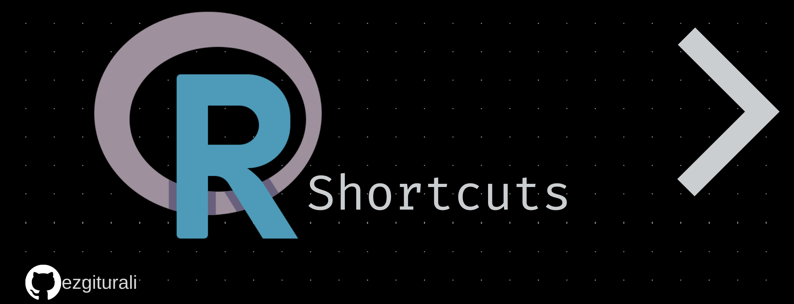

Bu yazıda, RStudio ile çalışırken üretkenliğinizi artırmaya yardımcı olmak ve size zaman kazandırmak için en sevdiğim klavye kısa yollarının çoğunu derledim. Mac kullanıcıları için bu kısa yollar değişiklik gösterebilir, bu yazıda sadece PC kısa yollarından bahsedeceğim. Eklemeler için pull request'lere tamamen açıktır. 
# Panel
| Kısa Yol | Açıklama |
| ------ | ------ |
| Ctrl + (istenen bölmeye karşılık gelen bir sayı): | RStudio panelindeki sekmeler arasında gezmenize olanak tanır. |
 
- 	Ctrl + 1: Source editor 
-	Ctrl + 2: Console
-	Ctrl + 3: Help
-	Ctrl + 4: History
-	Ctrl + 5: Files
-	Ctrl + 6: Plots
-	Ctrl + 7: Packages
-	Ctrl + 8: Environment
-	Ctrl + 9: Viewer

| Kısa Yol | Açıklama |
| ------ | ------ |
| Ctrl + (istenen bölmeye karşılık gelen bir sayı):  | RStudio panelindeki sekmeler arasında gezmenize olanak tanır |
| Ctrl + (sayı) + Shift:  | Bölmenin ekranı kaplamasını ayarlar |
| Shift + Alt + t: | Terminal |
| Ctrl + Enter: | Geçerli satırı çalıştırır ve bir sonrakine atlar veya daha fazla atlama yapmadan seçilen bölümü çalıştırır |
| Alt + Enter: | Bir kod satırını seçmeden birden çok kez çalıştırmak istiyorsanız, imleci sonraki satıra taşımadan kod çalıştırmaya izin verir |
| Ctrl + Alt + B:  | Başlangıçtan geçerli satıra kadar kodunuzu çalıştırır |
| Ctrl + I:  | Satır girintisini düzenler |
| Alt + Yukarı / Aşağı: | Kod satırları yukarı ve aşağı hareket ettirilir |
| Ctrl + D: | Geçerli kod satırını siler |
| Ctrl + Yukarı: | Kod geçmişinizi gösterir |
| Ctrl + L: | Konsolunuzu temizlerken kod geçmişinizi korur|
| Ctrl + F11 / F12: | Source Editor’de sekmeler arasında gezinmenizi sağlar |
| Ctrl + F11 / F12 + Shift: |  İlk ve son sekme arasında geçiş sağlar |
| Ctrl + w: | Geçerli sekmeyi kapatır |
# Kod Ekleme
| Kısa Yol | Açıklama |
| ------ | ------ |
| Alt + (-): | Atama operatörü ekler <- |
| Ctrl + Shift + M:  | Pipe operatörü ekler %>% |
| Ctrl + Shift + R:  | Yorum bölümü oluşturur |
| Ctrl + Alt + X:  | Seçtiğiniz ifadeyi fonksiyona dönüştürür |
| Ctrl + Shift + Alt + M: | Bul/Değiştir görevi görür |
